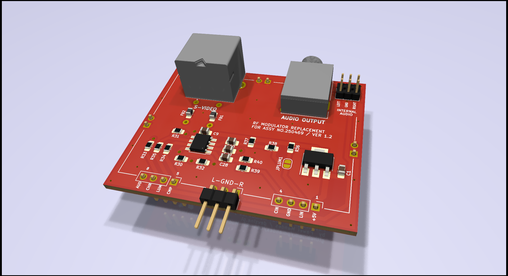

# C64-RF-Modulator

This is a project of a modulator replacement based on an analog c0pperdragon module. It was adjusted in size to the Commodore C64C motherboard and extended with S-Video and Strereo Audio outputs.

### Changelog:

1.2
- internal audio route to left and/or right channel
- ferrite beads to suppresses high-frequency electronic noise
- silkscreen layer with descriptions of all outputs and elements
- 3D models for a nice rendering
- project cleaned up and migrated to KiCad 6.0
- interactive BOM

1.1
- prototype fixes

1.0
- PCB size adjusted to C64C motherboards (ASSY No.250469)
- S-Video connector added (mini-DIN 4)
- added standard stereo audio mini-jack 3.5mm output

### Bill of materials:

### Final revision:

- all jumpers removed: audio output from an external source (e.g. MixSID)
- all jumpers on: mono signal from the motherboard connected to the left and right channels

### Prototype images:

The board connected to SixtyClone. Image from S-Video output:

The board can be soldered with pins to the motherboard. Then the S-Video and Audio outputs will be at the level of the corresponding openings in the housing.

### Links:
- c0pperdragon analog module: https://github.com/c0pperdragon/C64-Video-Enhancement/tree/master/analog_only
- order PCBs directly from PCBWay: https://www.pcbway.com/project/shareproject/Commodore_C64C_modulator_replacement_0f6cacf9.html

